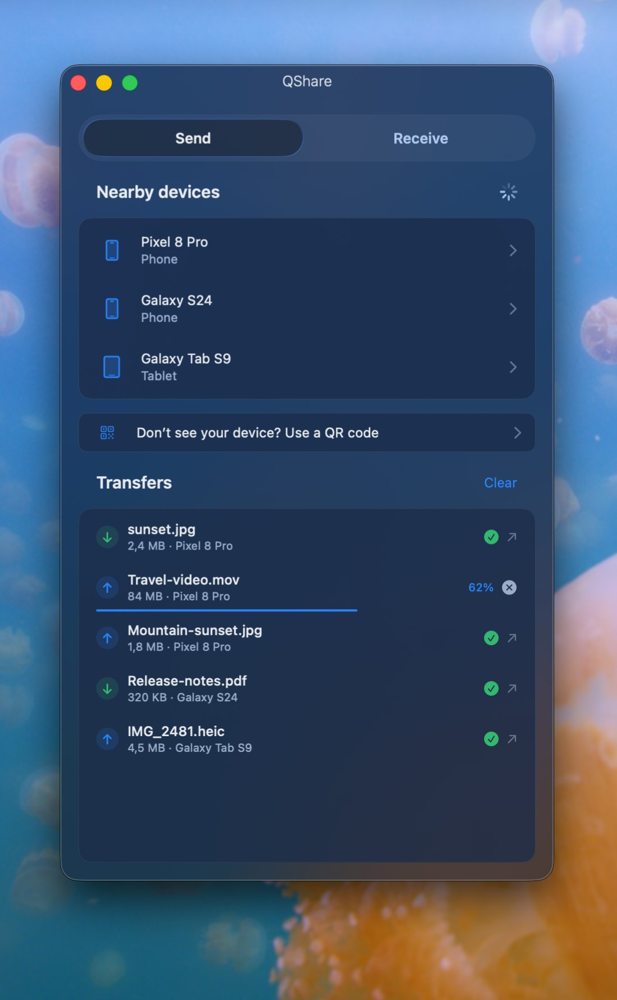

<h1 align="center">QShare</h1>

<p align="center">
  Send and receive files between your Mac and nearby Android devices,<br>
  using Google's <b>Quick Share</b> — implemented from scratch, with zero dependencies.
</p>

<p align="center">
  
  
  
</p>

<p align="center">
  
  &nbsp;&nbsp;
  
</p>

---

Android phones can share files with each other in two taps. Macs can't join in —
Quick Share has no Apple client, and AirDrop doesn't speak to Android. QShare
fills that gap: your Mac shows up in your phone's Quick Share sheet, and your
phone shows up in QShare's device list.

Quick Share is undocumented, so the protocol here is a clean implementation
written against a reverse-engineered specification: mDNS discovery, a UKEY2
key agreement, AES-256-CBC + HMAC-SHA256 secure messages, and chunked payload
transfer. It depends on nothing outside the OS.

## Features

- **Send** — pick a device, drag files onto it, or use the file picker
- **Receive** — toggle visibility and your Mac appears on the phone
- **PIN verification** — a 4-digit code shown on both screens before anything moves
- **Per-sender auto-accept** — opt in per device to skip the prompt ([caveats](#a-note-on-auto-accept))
- **QR code** — reach a phone that can't see you over mDNS
- **Menu-bar app** — keeps running with the window closed
- **Command-line API** — drive it from scripts or an agent (off by default)

## Requirements

**macOS 26 or later.** The interface uses Apple's Liquid Glass (`glassEffect`),
which is why `Package.swift` pins `.macOS("26.0")`. Built with Swift 6.3.

Both devices need to be on the same Wi-Fi network.

## Install

```bash
git clone https://github.com/kanin-design/QShare.git
cd QShare/App
./Packaging/build-app.sh
open build/QShare.app
```

The packaging step matters: real networking needs a proper `.app` bundle so
macOS will grant local-network access. A bare `swift run` binary can't get it.

## Usage

**To receive**, open the Receive tab and turn on visibility. The card shows a
live indicator once your Mac is genuinely published to the network — not merely
when you flipped the switch. Then on your phone: share a file, pick your Mac,
confirm the PIN.

**To send**, pick a device from the Send tab and drag files onto it, or drop
them straight onto a device row. If the phone doesn't appear, use the QR code —
scanning it gets you connected without discovery.

Received files land in `~/Downloads` by default; change that in Settings.

### Keyboard

| | |
|---|---|
| `⌘1` / `⌘2` | Send / Receive |
| `⇧⌘V` | Toggle visibility |
| `⇧⌘O` | Open downloads folder |
| `⌃⌥←` / `⌃⌥→` | Snap window to screen edge |
| `⌘⌥I` | Build info |

## Command line

QShare can host a small JSON API on `127.0.0.1:47821` for scripting and
automation. It is **off by default** — enable it in *Settings → Services*.

> While it's on, anything running under your account can ask QShare to send any
> file it can read to a nearby device. That's the point of the feature, and the
> reason it's opt-in.

```bash
ln -s "$(pwd)/App/Packaging/qshare" /usr/local/bin/qshare

qshare list                                   # devices currently visible
qshare send ~/photo.jpg --to "Pixel 8 Pro"    # blocks; exit 0 on success
qshare status --json                          # machine-readable
```

Requests are authenticated with a token in `~/.config/qshare/token`. Full
endpoint reference: **[docs/API.md](docs/API.md)**.

## How it works

```
Views (SwiftUI)  ──observe──▶  AppModel  ──▶  QuickShareService
                                                     │
                                          ┌──────────┴──────────┐
                                     MockService          QuickShareEngine
                                    (QS_MOCK=1)                 │
                                                    ┌───────────┴───────────┐
                                               Discovery              Transport
                                            mDNS · QR · TXT      framing · sessions
                                                                        │
                                                             Crypto ─── Wire
                                                            UKEY2 P-256  protobuf
```

`Sources/QuickShareProtocol/` is the protocol; `Sources/QuickShare/` is the app.
The seam between them is one protocol (`QuickShareService`), which is also what
makes the mock engine possible.

Some numbers, because they're the interesting part:

| | |
|---|---|
| Protocol implementation | ~3,800 lines |
| App | ~3,400 lines |
| Tests | ~3,600 lines |
| Third-party dependencies | **0** |

The wire format is hand-written rather than generated — only ~32 of the
protocol's messages are ever exchanged, which is a fraction of the schema. Every
one is asserted byte-identical to a reference encoder, and the parsers that face
the network are tested against truncation, bit-flips and random input.

See **[docs/ARCHITECTURE.md](docs/ARCHITECTURE.md)** for the design and the
protocol details worth knowing.

## Development

```bash
cd App
swift test                              # 137 tests
swift test --sanitize=thread            # concurrency
QS_MOCK=1 swift run QuickShare          # UI work without a phone
```

`QS_MOCK=1` runs a simulated engine that drives every UI state — devices, PINs,
progress, completion — with no network at all. The screenshots above were taken
with it.

## A note on auto-accept

Auto-accept is per-device and off until you turn it on. It's worth knowing
exactly what it does and doesn't promise.

Quick Share, as implemented here, exposes **no verifiable device identity**. The
UKEY2 keys are generated fresh for every handshake, and the certificate frames
that would carry a persistent identity are not implemented in the specification
this is built from. The only thing a sender proves is the name it chose to
advertise.

So enabling auto-accept for "Pixel 8 Pro" means: anything on your network
calling itself *Pixel 8 Pro* will be accepted without a prompt. That's why
auto-accepted transfers still post a notification rather than landing silently,
and why it's off by default. For anything you care about, leave it off and
confirm the PIN.

## Status

Working: discovery, advertising, sending, receiving, QR, progress, menu bar,
CLI, per-device auto-accept, configurable receive folder.

Not yet:

- [ ] Finder share extension (share-sheet entry point)
- [ ] Fuzzing the protobuf decoders
- [ ] Quarantine attribute on received files
- [ ] Verifiable device identity (would make auto-accept trustworthy)

## Credits

Quick Share is undocumented. The protocol was reverse-engineered and specified
by **@grishka**, published at
**[grishka/NearDrop](https://github.com/grishka/NearDrop)** and released into
the public domain.

QShare implements the protocol from that specification — the code here is its
own, but the knowledge isn't. See **[ATTRIBUTION.md](ATTRIBUTION.md)** for
detail.

Not affiliated with or endorsed by Google. "Quick Share" and "Nearby Share" are
their trademarks.
