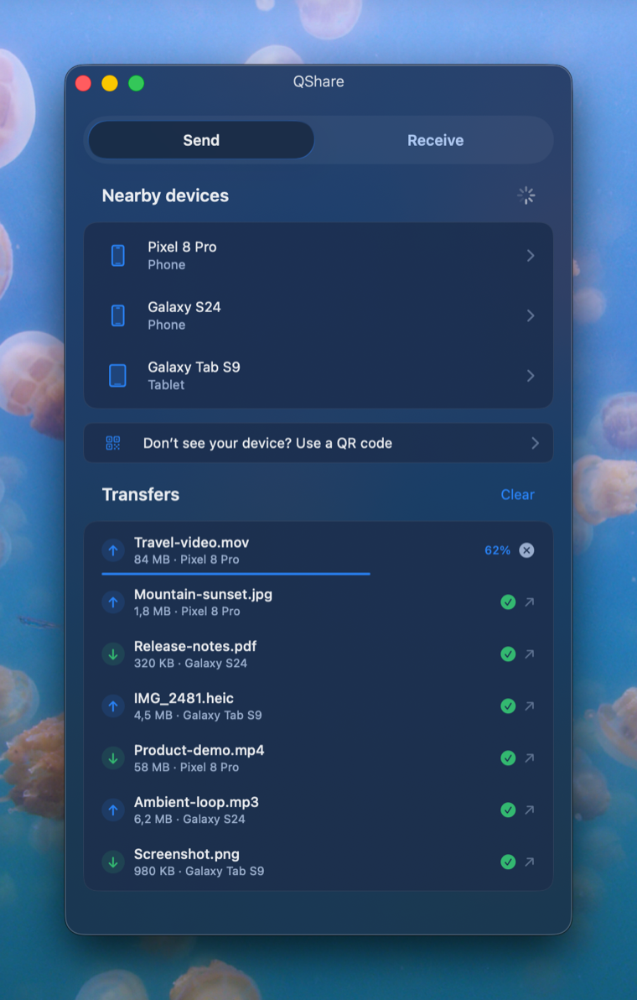
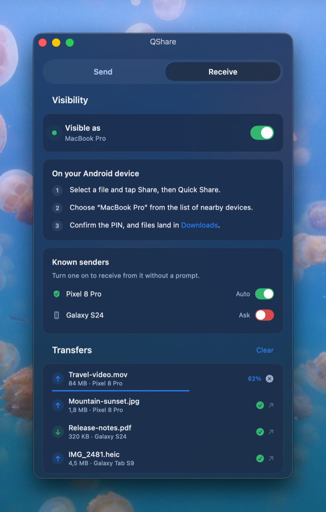

# QShare

A native macOS app for **Quick Share** (Google's Nearby Share) — send and receive
files to/from nearby Android devices over Wi-Fi LAN.

The Quick Share protocol is **implemented here from scratch** — mDNS
discovery/advertising, UKEY2 handshake, secure messages and payload transfer —
with **no third-party dependencies**. A **mock engine** is available for UI work
without an Android device (`QS_MOCK=1`).

<p align="center">
  
  &nbsp;&nbsp;
  
</p>

## Layout

```
QuickShare2/
├── App/                     ← native SwiftUI app (Swift package)
│   └── Sources/
│       ├── QuickShare/         the app: App/, Models/, Services/, Views/, Design/
│       └── QuickShareProtocol/  the protocol: Wire/, Messages/, Crypto/, Transport/, Discovery/
├── Resources/
│   └── NearDrop/            ← the reverse-engineered protocol spec + UNLICENSE
├── docs/
│   └── ARCHITECTURE.md      design + engine integration notes
└── ATTRIBUTION.md           credits for NearDrop and dependencies
```

## Run it

Real networking (Bonjour/mDNS) needs a proper app bundle so macOS can grant
local-network access — a bare `swift run` binary can't get it. Use the packager:

```bash
cd App
./Packaging/build-app.sh          # builds build/QShare.app (release)
open build/QShare.app
```

For **UI work without an Android device**, run the mock engine directly:

```bash
cd App
QS_MOCK=1 swift run QuickShare     # simulated devices, PINs, progress
# or open in Xcode:  open Package.swift
```

Requires **macOS 26+** — the UI uses Apple's real Liquid Glass (`glassEffect`),
which is why `Package.swift` sets `.macOS("26.0")`. Built with Swift 6.3 / Xcode 26.

## CLI / automation (`qshare`)

The app can host a localhost JSON API on `127.0.0.1:47821`, guarded by a token in
`~/.config/qshare/token`. The `qshare` CLI (or any tool/AI) drives it.

Enable it first in **Settings > Automation** — it's **off by default**, because
while it's on anything running under your account can ask QShare to send any file
it can read to a nearby device.

```bash
# install the CLI (app must be running for it to work):
ln -s "$(pwd)/App/Packaging/qshare" /usr/local/bin/qshare

qshare list                                  # visible devices
qshare list --json                           # machine-readable
qshare send ~/photo.jpg --to "Noise's phone" # blocks until sent; exit 0 on success
qshare status
qshare --help
```

Full spec + agent recipe: **[docs/API.md](docs/API.md)** (endpoints, JSON shapes, examples, error codes).

## Status

- [x] Research + protocol/prior-art review (see docs/ARCHITECTURE.md)
- [x] Native SwiftUI shell, minimal design, Send + Receive flows
- [x] Mock engine driving all UI states (`QS_MOCK=1`)
- [x] Vendor NearDrop's `NearbyShare/` protocol core → `NearbyShareKit` target
- [x] Real engine wrapper (`NearbyQuickShareService`) — discovery, advertise,
      handshake, send, receive, in-app progress (incoming progress hook added)
- [x] `.app` bundle with Bonjour + local-network Info.plist
- [x] End-to-end verified against a real Android device (send + receive)
- [x] Path-traversal hardening on incoming file names
- [x] App icon (native squircle)
- [x] Menu-bar presence (stays alive in the background)
- [x] Every incoming transfer requires explicit approval (no auto-accept — see
      the note below)
- [ ] User notifications for incoming requests while the window is closed
- [ ] Finder share extension (share sheet entry point)
- [ ] Configurable receive location (currently ~/Downloads, like NearDrop)
- [ ] Further frame-parser hardening / fuzzing
- [ ] Verifiable device identity (would re-enable safe auto-accept)

## Note on trusted devices

QShare deliberately has **no auto-accept**. Quick Share, as implemented here,
exposes no identity we can verify: the UKEY2 keys are generated fresh per
handshake, and the paired-key/certificate frames that would carry a persistent
identity are stubbed out in the vendored engine. The only thing a sender
supplies is a display name, which is unauthenticated — auto-accepting on it
would let anything on the network write to your receive folder just by claiming
the name. The app remembers names you've accepted from and shows that as a hint,
nothing more.
```
